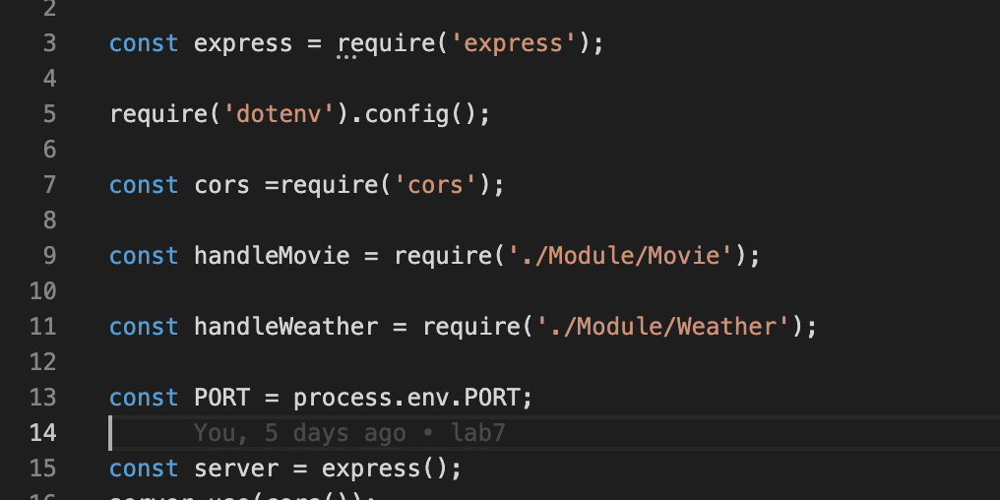
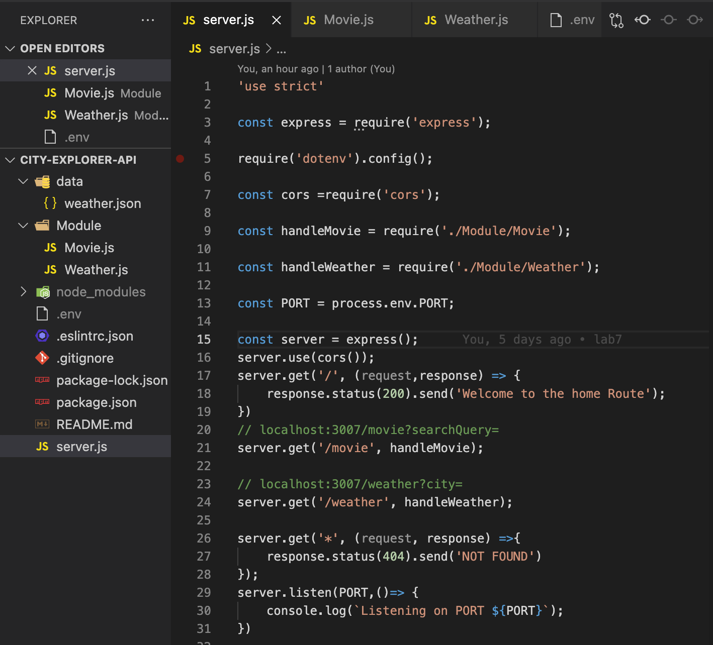
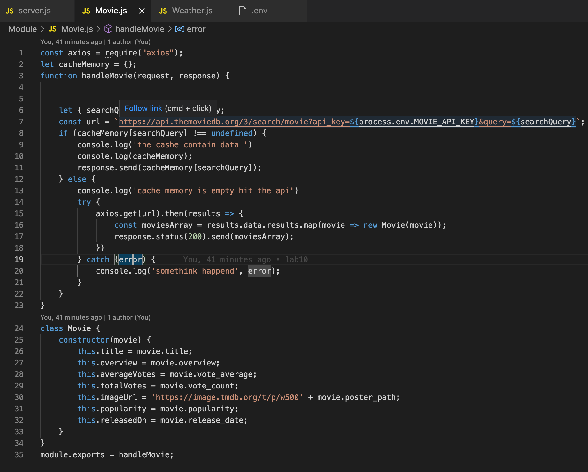
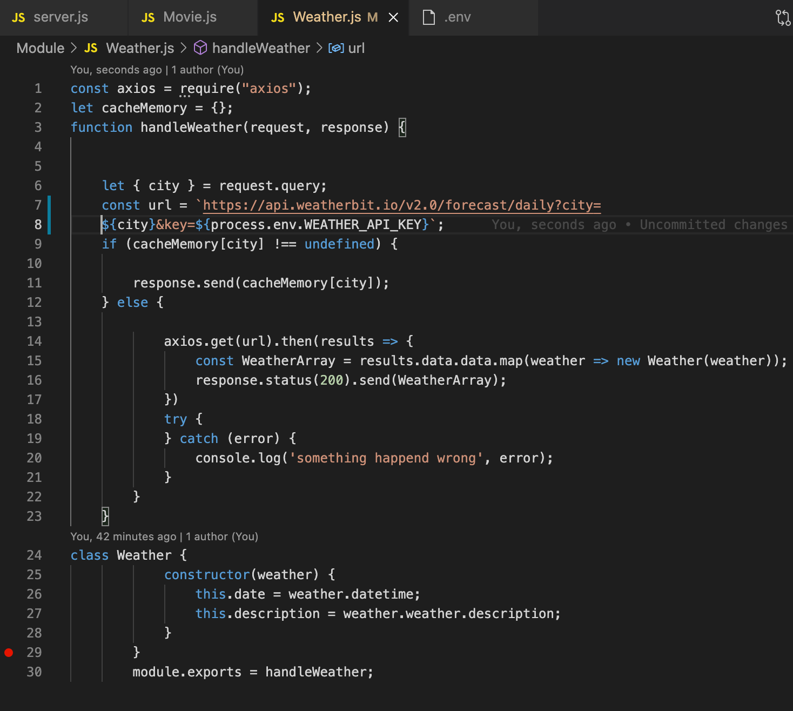
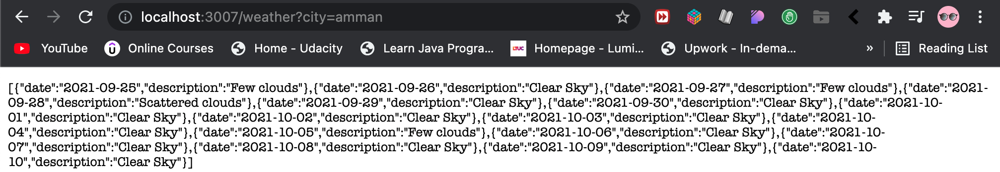
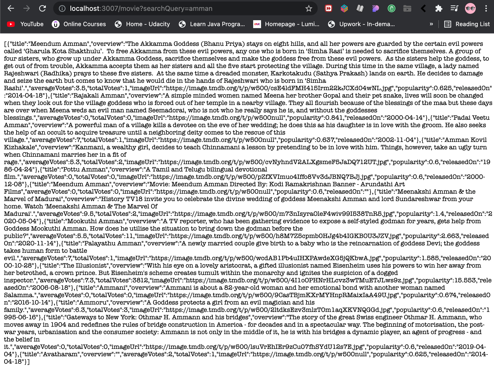
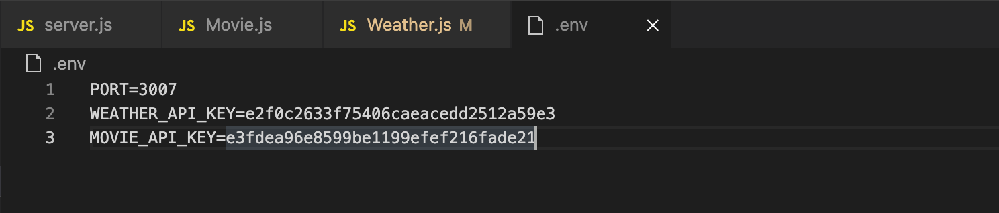

# White-Box

- Defnition: it is an software testing method will test how the code that we are testing our works also it known as the implementation details for the code have been tested.

## How it use?

- it use in three step:

1. prepare for test

2. create and execute test

3. creat the final report.

## Type of White box testing

1. Unit testing

2. Integration testing

3. Regression testing

## review code

- here as we see i use  the const to get variable from it when i call it 

- here is my backend so let me explain it as we see we have a picture that show the code in the backend so i do many thing the first thing is 'constractor' and i use it to get the data from the movie and weather function to call it then i put an port to let us

- 
- 
- 

- now when i want to test my backend with the port that i used it will give me this result when i use the link for the location and the weather also i take this information from another api that have this data already im just call it to my code.

- 
- 

- how i use this data from another site that i deploey it to my code from this key's so this key let me as a devloper allow to take the data and use it in my code but i have an limit to use it

- 
